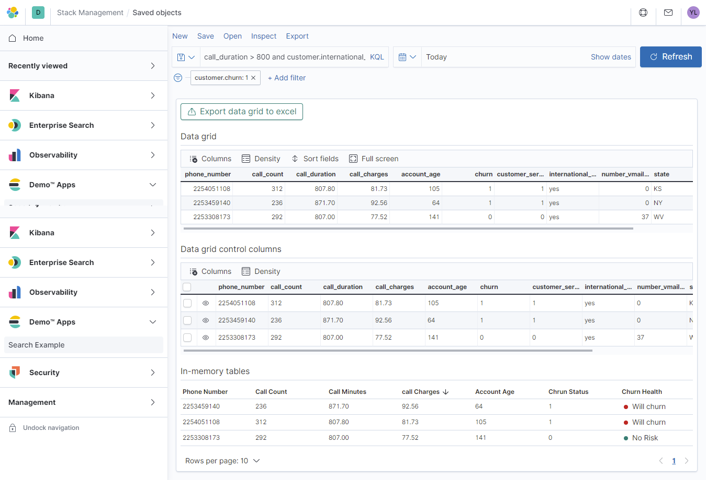
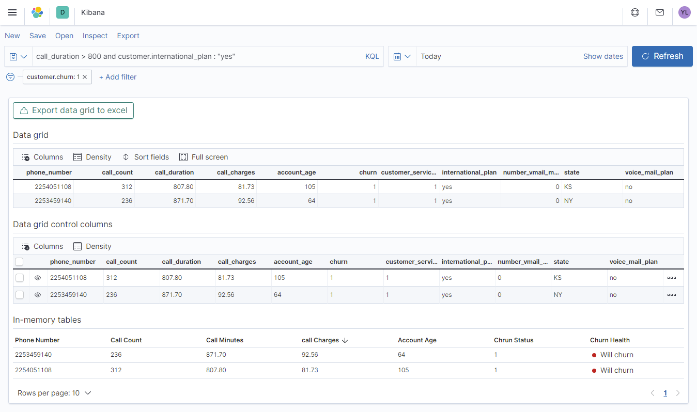
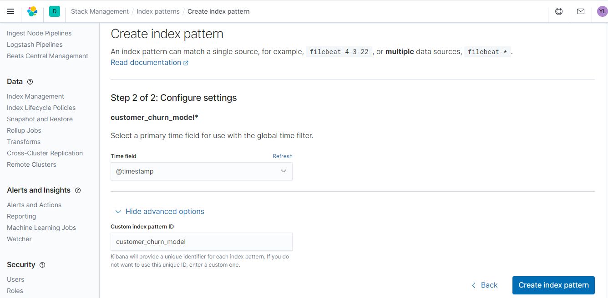
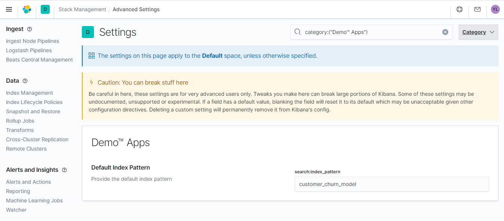

# TopNavMenu Search Example

> This is an example of how to develop a new plugin in Kibana using the new platform. We will demo how the stateful component `TopNavMenu` can be integrated into your application.

> This is a personal work and subject to enhancements, do not hesitate to share your comments and send PR to help the community.

> Most of code in this resposiroty is inspired from [Kibana Officiel repository](https://github.com/elastic/kibana)

> This example has been tested under windows using Kibana master repository (version 8.0.0 at the moment of writing this memo), with node.js v10.21.0 & yarn 1.21.1

> For more advanced docummentation about Kibana plugins API, i suggest to visit this [Link](https://github.com/elastic/kibana/tree/master/src/core)
---

## Get started building your own plugins

### 1- Get the code
Fork, then clone the Kibana repo and change directory into it, or simply clone direclty Kibana repo :

```
git clone https://github.com/elastic/kibana.git
cd kibana
```
### 2- Install dependencies

Install the version of Node.js listed in the `.node-version` file

```
10.21.0
```
or in `package.json` file and Install the latest version of yarn.

````json
"engines": {
    "node": "10.21.0",
    "yarn": "^1.21.1"
  }
````
Bootstrap Kibana and install all the dependencies:
```
yarn kbn bootstrap
```

### 3- Run Elasticsearch
Run the latest Elasticsearch snapshot. Specify an optional license with the `--license` flag.

```
yarn es snapshot --license trial
```

trial will give you access to all capabilities.

Read about more options for [Running Elasticsearch during development](https://www.elastic.co/guide/en/kibana/master/running-elasticsearch.html), like connecting to a remote host, running from source, preserving data inbetween runs, running remote cluster, etc.

### 4- Run Kibana

In another terminal window, start up Kibana.
Include developer examples by adding an optional `--run-examples` flag

```
yarn start --run-examples
```
View all available options by running yarn start --help

Read about more advanced options for [Running Kibana](https://www.elastic.co/guide/en/kibana/master/running-kibana-advanced.html)

### 5- Code away

You are now ready to start developing. Changes to your files should be picked up automatically. Server side changes will cause the Kibana server to reboot.

### 6- Plugin Generator

We recommend that you kick-start your plugin by generating it with the Kibana Plugin Generator. Run the following in the Kibana repo, and you will be asked a couple questions, see some progress bars, and have a freshly generated plugin ready for you to play with in Kibana’s plugins folder.

```
node scripts/generate_plugin my_plugin_name 
```

replace `my_plugin_name` with your desired plugin name
make sure the folder `plugins` is created on the kibana home.

> To undertsand the plugin structure
 with the new plateform visit this [link](https://github.com/elastic/kibana/blob/master/src/core/CONVENTIONS.md)


```
my_plugin/
├── kibana.json
├── public
│   ├── applications
│   │   ├── my_app
│   │   │   └── index.ts
│   │   └── index.ts
│   ├── services
│   │   ├── my_service
│   │   │   └── index.ts
│   │   └── index.ts
│   ├── index.ts
│   └── plugin.ts
└── server
    ├── routes
    │   └── index.ts
    ├── collectors
    │   └── register.ts
    ├── saved_objects
    │   ├── index.ts
    │   └── my_type.ts
    ├── services
    │   ├── my_service
    │   │   └── index.ts
    │   └── index.ts
    ├── index.ts
    └── plugin.ts
```
### 7- Elastic UI Framework
If you’re developing a plugin that has a user interface, take a look at [Elastic UI Framework](https://elastic.github.io/eui). It documents the CSS and React components used by Elastic team to build Kibana’s user interface.

You’re welcome to use these components, but be aware that they are rapidly evolving, and Elastic team might introduce breaking changes that will disrupt your plugin’s UI.

## Search Example with TopNavMenu

> This example will show how to register a new application into the side nav bar of Kibana


 
 > The application will provide access to TopNavBar like in Discovery app, the result of the query will be dispalyed in differents formats (In memory table, Simple Data grid and advanced Data Grid, all theses components are provided by [EUI framework](https://elastic.github.io/eui))



- Go to kibana/plugins and clone the respository
```
cd kibana/plugins
git clone https://github.com/synapticiel/np_search_example.git
```

- Bootsrap the projet in order to install dependencies (includeed in `package.json` of the plugin)

```
yarn kbn bootstrap
````

- Create the index to be used for the demo

```json
PUT customer_churn_model
{
  "settings": {
    "number_of_shards": 1,
    "number_of_replicas": 0
  },
  "mappings": {
    "properties": {
      "customer": {
        "properties": {
          "account_age": {
            "type": "integer"
          },
          "churn": {
            "type": "integer"
          },
          "customer_service_calls": {
            "type": "integer"
          },
          "international_plan": {
            "type": "keyword"
          },
          "number_vmail_messages": {
            "type": "integer"
          },
          "phone_number": {
            "type": "keyword"
          },
          "record_id": {
            "type": "keyword"
          },
          "state": {
            "type": "keyword"
          },
          "voice_mail_plan": {
            "type": "keyword"
          }
        }
      },
      "phone_number": {
        "type": "keyword"
      },
      "call_charges": {
        "type": "double"
      },
      "call_duration": {
        "type": "double"
      },
      "call_count": {
        "type": "double"
      }
    }
  }
}
```

- Load some samples into `customer_churn_model`
```json
POST _bulk
{ "index" : { "_index" : "customer_churn_model", "_id" : "1" } }
{"phone_number":"2253709563","call_charges":69.33000000000007,"call_duration":653.6000000000007,"customer":{"voice_mail_plan":"yes","number_vmail_messages":"26","churn":"0","account_age":"32","phone_number":"2253709563","state":"UT","international_plan":"no","customer_service_calls":"1"}}
{ "index" : { "_index" : "customer_churn_model", "_id" : "2" } }
{"phone_number":"2253978051","call_charges":57.98999999999999,"call_duration":559.1999999999999,"customer":{"voice_mail_plan":"no","number_vmail_messages":"0","churn":"0","account_age":"71","phone_number":"2253978051","state":"IL","international_plan":"no","customer_service_calls":"1"}}
{ "index" : { "_index" : "customer_churn_model", "_id" : "3" } }
{"phone_number":"2253759180","call_charges":61.67000000000001,"call_duration":615.2,"customer":{"voice_mail_plan":"no","number_vmail_messages":"0","churn":"0","account_age":"69","phone_number":"2253759180","state":"OR","international_plan":"no","customer_service_calls":"0"}}
```

- Check the result of the bulk process and make sure index `customer_churn_model` is populated with samples

```json
{
  "took" : 64,
  "errors" : false,
  "items" : [
    {
      "index" : {
        "_index" : "customer_churn_model",
        "_id" : "1",
        "_version" : 1,
        "result" : "created",
        "_shards" : {
          "total" : 1,
          "successful" : 1,
          "failed" : 0
        },
        "_seq_no" : 9999,
        "_primary_term" : 2,
        "status" : 201
      }
    },
    {
      "index" : {
        "_index" : "customer_churn_model",
        "_id" : "2",
        "_version" : 1,
        "result" : "created",
        "_shards" : {
          "total" : 1,
          "successful" : 1,
          "failed" : 0
        },
        "_seq_no" : 10000,
        "_primary_term" : 2,
        "status" : 201
      }
    },
    {
      "index" : {
        "_index" : "customer_churn_model",
        "_id" : "3",
        "_version" : 1,
        "result" : "created",
        "_shards" : {
          "total" : 1,
          "successful" : 1,
          "failed" : 0
        },
        "_seq_no" : 10001,
        "_primary_term" : 2,
        "status" : 201
      }
    }
  ]
}
```
- Create an index pattern with id `customer_churn_model` related to index `customer_churn_model` and make sure to select `@timestamp` as the default time field




- This id will be used by the app to query elasticsearch using the data plugin of Kibana NP, you can change the index pattern using `Advanced Settings` of Kibana


